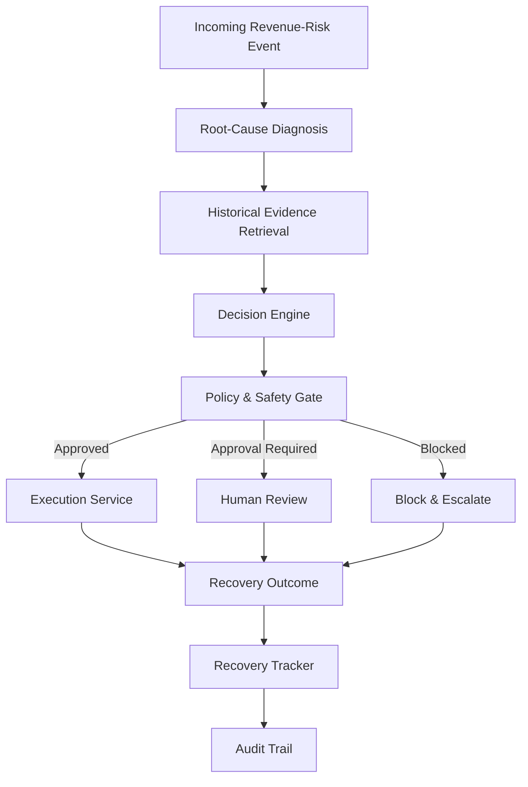
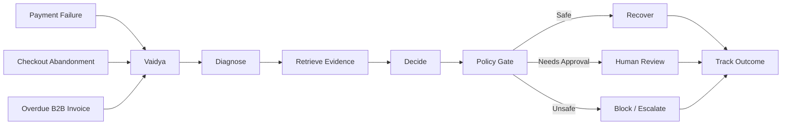
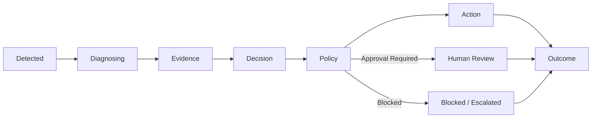
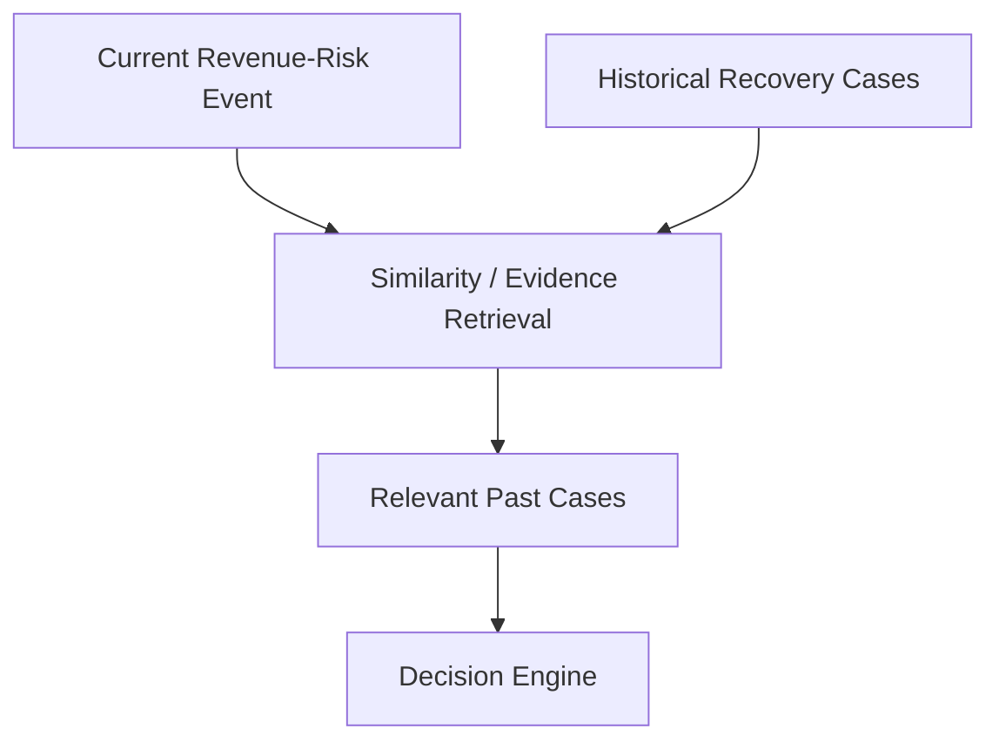
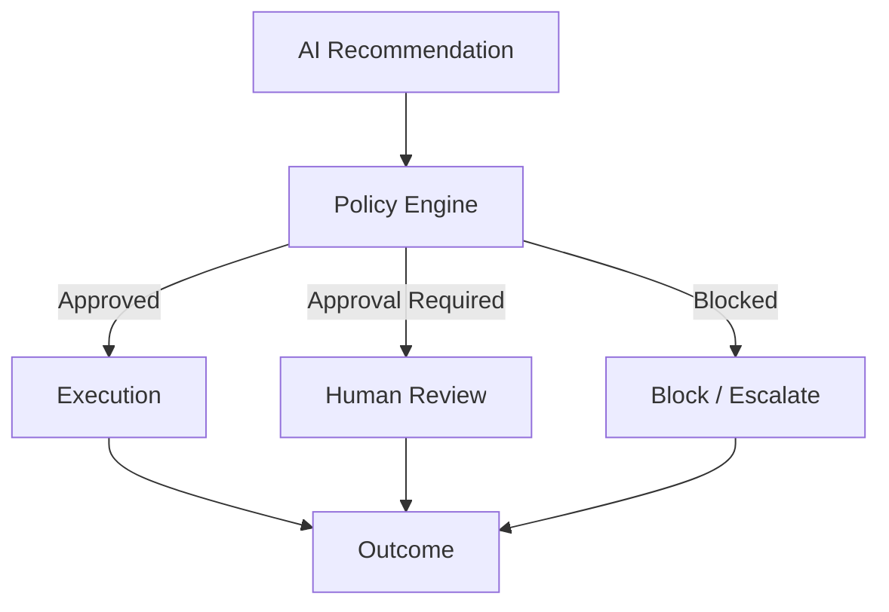
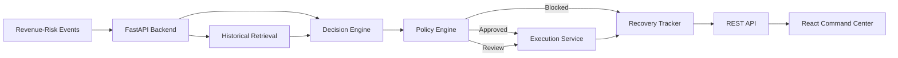

# Vaidya — The Revenue Recovery Agent

**Razorpay AI Builder Internship 2026 — Track 03: AI Revenue Recovery**

Vaidya is an autonomous revenue recovery agent that finds revenue currently at risk of being lost, diagnoses *why* it's at risk, retrieves evidence from similar historical cases, decides the correct recovery action, checks that action against safety policy, executes it, and tracks the outcome  end to end, with a full audit trail.

> Diagnose the failure. Prescribe the right fix. Recover the revenue  safely.

## 🚀 Live Demo

🌐 **[Live Frontend](https://vaidya-tan.vercel.app)**

⚙️ **[Backend API](https://vaidya-production-a999.up.railway.app)**

📚 **[API Documentation](https://vaidya-production-a999.up.railway.app/docs)**

---

## The problem

Revenue loss rarely happens in one clean step. It leaks out across three different surfaces:

- **Payment failures** — a transaction is declined, times out, or cannot be completed
- **Checkout abandonment** — a customer starts paying but leaves before completing the payment
- **Overdue B2B invoices** — a business customer does not pay an invoice on time

A simple recovery system can treat all of these events the same way: retry a payment or send a generic reminder.

But the reason behind the revenue loss matters.

A temporary network failure may deserve a retry.

An abandoned checkout may need a targeted reminder.

A repeated late payer may need a promise-to-pay workflow.

A fraud-risk event should **not** be automatically recovered at all.

Vaidya exists to answer one question for every unit of at-risk revenue:

**What is the one correct action to take right now, and is it actually safe to take it?**

---

## The approach

Vaidya doesn't treat recovery as a single retry operation.

Every revenue-risk event goes through the same disciplined pipeline:



No recovery action bypasses the policy layer.

The system separates **recommendation, authorization, execution, and outcome tracking** so that an intelligent recommendation does not automatically become an unsafe action.

---

## Three revenue surfaces — one recovery agent

Vaidya handles three major sources of revenue risk through one common recovery pipeline.



### Payment failures

Vaidya distinguishes between different payment failure causes instead of blindly retrying every failed transaction.

Examples include:

- Network timeout
- Insufficient funds
- Bank timeout
- Expired card
- Recurring mandate failure
- Fraud risk

A recoverable technical failure can be routed toward a retry, while high-risk cases are stopped or escalated.

### Checkout abandonment

A checkout abandonment is not treated as a failed payment.

For high-intent abandonment, Vaidya can select a **targeted reminder** rather than attempting a payment retry.

### Overdue B2B invoices

For overdue invoices, Vaidya considers the customer's payment behavior and historical evidence.

For suitable cases, the agent can recommend a **promise-to-pay** workflow.

High-value or low-confidence cases can be routed to **human review** instead of being automatically executed.

---

## Why Vaidya is different

Traditional recovery automation often follows a simple rule:

```text
Payment failed → Retry
Invoice overdue → Send reminder
```

Vaidya adds an intelligence and safety layer:

```text
Revenue Risk
     ↓
Diagnose the cause
     ↓
Retrieve similar historical evidence
     ↓
Select the most appropriate action
     ↓
Check policy and risk
     ↓
Automate / Review / Block
     ↓
Execute
     ↓
Track outcome
     ↓
Audit
```

This makes the system **reasoned, policy-controlled, and traceable** rather than simply action-oriented.

---

## Agent decision pipeline

The Vaidya command center exposes the internal recovery lifecycle for each case.



Every processed case can be inspected individually through its **Case ID**.

The case view exposes the reasoning and execution path instead of hiding the decision behind a single status.

---

## Core capabilities

### 1. Revenue-risk detection

Vaidya accepts revenue-risk events across:

- Payment failures
- Checkout abandonment
- Overdue invoices

Each event becomes a traceable recovery case.

### 2. Root-cause diagnosis

The agent identifies the reason associated with the revenue risk.

Examples:

| Event | Root cause | Typical action |
|---|---|---|
| Payment failure | Network error | Retry |
| Payment failure | Insufficient funds | Recovery decision based on context |
| Payment failure | Bank timeout | Retry / review |
| Payment failure | Expired card | Payment-method recovery |
| Payment failure | Fraud risk | Block and escalate |
| Checkout abandonment | High-intent abandonment | Targeted reminder |
| Overdue invoice | Repeated late payer | Promise to pay |

The final action is still passed through the policy layer before execution.

---

## Historical evidence and retrieval

Vaidya uses historical recovery cases as evidence for decision making.

The retrieval layer allows the decision engine to consider similar cases instead of treating every event independently.

Conceptually:



Historical evidence can help answer questions such as:

- Has this customer or failure pattern appeared before?
- What action worked in similar situations?
- How confident should the agent be?
- Should this case be automated or reviewed?

Historical evidence is **supporting evidence**, not proof that a new payment has already been recovered.

---

## Decision engine

The decision engine combines the current event with available evidence to produce a structured recommendation.

A decision contains information such as:

- Recommended action
- Decision mode
- Confidence
- Expected recovery
- Risk context
- Human-review requirement

Possible decision paths include:

```text
AUTOMATE
   ↓
Policy approval
   ↓
Execute recovery
```

or:

```text
HUMAN REVIEW
   ↓
Approval required
   ↓
Human-controlled execution
```

or:

```text
ESCALATE
   ↓
Policy blocked
   ↓
No automatic recovery
```

---

## Policy & safety layer

The policy engine is a mandatory gate between decision and execution.



The policy layer evaluates factors such as:

- Action validity
- Risk level
- Confidence
- Human-review requirements
- High-value recovery
- Fraud-risk conditions

### Fraud safety

Fraud-risk events are treated differently from normal recovery opportunities.

```text
Fraud Risk Detected
        ↓
Policy Gate
        ↓
BLOCKED
        ↓
Human Review / Escalation
```

Vaidya does **not** automatically attempt to recover fraud-risk transactions.

---

## Execution service

Once an action passes the policy layer, the execution service handles the selected recovery action.

Supported prototype actions include:

- `retry`
- `targeted_reminder`
- `promise_to_pay`
- `block_and_escalate`
- `human_review`

The execution result records information such as:

- Execution status
- Outcome
- Recovered amount
- Remaining amount
- Human-review requirement
- Execution message
- Timestamp

The current build uses a **prototype execution simulation** for the buildathon demonstration rather than claiming live production payment execution.

---

## Recovery outcome tracking

Vaidya maintains a recovery record for processed cases.

For each case, the system tracks:

```text
Amount at risk
      ↓
Amount recovered
      ↓
Remaining amount
      ↓
Final outcome
```

This enables the command center to calculate operational metrics such as:

- Total amount at risk
- Recovered revenue
- Remaining / gated revenue
- Recovery rate
- Successful recoveries
- Partial recoveries
- Failed recoveries
- Blocked cases
- Human-review cases

---

## Case Explorer

The **Case Explorer** provides an operational view of processed recovery cases.

Users can:

- Search by Case ID
- Search by event information
- Filter by event type
- Filter by action
- Filter by outcome
- Filter by human-review status
- Browse records page by page
- Open individual cases
- Inspect the complete decision and execution trail

Each case is individually traceable.

### Processed Records vs Source Batch Explorer

Vaidya separates two different layers of information.

**Processed Records**

These are recovery cases that Vaidya has actually processed through its recovery pipeline.

They contain the resulting:

- Decision
- Action
- Policy result
- Execution status
- Outcome
- Recovery amount
- Audit information

**Source Batch Explorer**

This represents the incoming source events grouped into batches before or while they are processed.

This distinction makes it possible to answer:

> What events entered the system?

and separately:

> What did Vaidya actually do with them?

---

## Human review

Not every recovery decision should be automated.

Cases can be routed to human review when:

- Confidence is insufficient
- Recovery value is high
- Policy requires approval
- Risk is elevated
- The action is not safe for automatic execution

The Human Review interface provides a dedicated queue for these cases.

This creates a clear separation between:

**AI recommendation → human authorization → execution**

rather than allowing the AI recommendation to directly bypass governance.

---

## Command Center

The Command Center acts as the operational control surface for Vaidya.

It provides visibility into:

- Amount at risk
- Recovered revenue
- Remaining / gated revenue
- Recovery rate
- Cases tracked
- Human-review cases
- Blocked cases
- Live recovery activity
- Execution engine status
- Batch processing
- Recovery outcomes

The live feed also exposes the agent pipeline for individual events:

```text
Detected
   ↓
Diagnosing
   ↓
Evidence
   ↓
Decision
   ↓
Policy
   ↓
Action
   ↓
Outcome / Review
```

---

## Analytics

The Analytics section provides a higher-level view of recovery performance.

It is designed to answer:

- How much revenue was at risk?
- How much was recovered?
- What is the recovery rate?
- Which event types generate the most risk?
- Which actions are being used?
- How many cases require human intervention?
- How much revenue remains unrecovered or gated?

This separates **operational case management** from **performance analysis**.

---

## Action History

The Action History page provides a chronological view of recovery activity.

It can be used to inspect:

- Case ID
- Event type
- Action
- Outcome
- Amount
- Human-review status
- Timestamp

Pagination allows the recovery ledger to be inspected beyond the first page.

---

## Policies

The Policies page exposes the active governance configuration used by the recovery system.

This makes the safety layer visible rather than treating it as hidden backend logic.

The goal is simple:

> An AI recommendation can suggest an action, but policy determines whether that action is allowed to execute.

---

## System Health

The System Health page provides operational visibility into the major backend subsystems.

It helps verify that the recovery pipeline and its supporting services are available.

The frontend periodically checks backend system status so that the command center can surface subsystem health.

---

## Integration & execution

Vaidya is structured so that the recovery pipeline can eventually connect to payment and communication infrastructure.

For the current buildathon prototype:

- Backend APIs are exposed through FastAPI
- Frontend communicates with the backend through REST APIs
- Recovery execution is simulated
- Source events are represented using prepared datasets
- The architecture is designed for integration with real payment infrastructure later

The prototype intentionally does **not** claim live production Razorpay transaction execution.

---

## Architecture



The main architectural principle is:

**Intelligence proposes. Policy governs. Execution acts. Tracking verifies.**

---

## Technology stack

### Backend

- Python
- FastAPI
- Pydantic
- Pandas
- NumPy
- Uvicorn

### Frontend

- React
- TypeScript
- Vite
- Tailwind CSS

### Data

Vaidya uses structured datasets representing:

- Payment failure events
- Checkout abandonment events
- Overdue invoice events
- Historical recovery cases
- Canonical processed events

The project also includes source/raw data used during data preparation and generation.

---

## Project structure

```text
Vaidya/
│
├── backend/
│   ├── app/
│   │   ├── api/
│   │   │   ├── health.py
│   │   │   └── recovery.py
│   │   │
│   │   ├── services/
│   │   │   ├── decision_engine.py
│   │   │   ├── execution_service.py
│   │   │   ├── historical_case_generator.py
│   │   │   ├── invoice_generator.py
│   │   │   ├── orchestrator.py
│   │   │   ├── policy_engine.py
│   │   │   ├── recovery_tracker.py
│   │   │   ├── retrieval_service.py
│   │   │   ├── scenario_generator.py
│   │   │   ├── checkout_generator.py
│   │   │   └── data_processor.py
│   │   │
│   │   ├── core/
│   │   └── models/
│   │
│   ├── data/
│   │   └── generated/
│   │       └── recovery_records.json
│   │
│   ├── main.py
│   ├── inspect_data.py
│   └── requirements.txt
│
├── data/
│   ├── generated/
│   │   ├── checkout_abandonment_events.csv
│   │   ├── historical_recovery_cases.csv
│   │   ├── overdue_invoice_events.csv
│   │   └── payment_failure_events.csv
│   │
│   ├── processed/
│   │   └── canonical_events.csv
│   │
│   └── raw/
│       └── source datasets
│
├── docs/
│   └── data_schema.md
│
└── frontend/
    ├── src/
    │   ├── api/
    │   ├── components/
    │   ├── hooks/
    │   ├── lib/
    │   └── types/
    │
    ├── package.json
    └── vite.config.ts
```

---

## API surface

The backend exposes REST endpoints for the recovery operations console.

### Health

```text
GET /health
```

Used to verify backend availability.

### Analyze a recovery event

```text
POST /api/recovery/analyze
```

Runs a revenue-risk event through the recovery pipeline.

### Recovery records

```text
GET /api/recovery/records
```

Returns processed recovery records with search, filtering and pagination.

### Recovery summary

```text
GET /api/recovery/summary
```

Returns aggregate recovery metrics.

### Batches

```text
GET /api/recovery/batches
```

Returns available source batches.

### Batch events

```text
GET /api/recovery/batches/{id}/events
```

Returns source events belonging to a selected batch.

### Individual case

```text
GET /api/recovery/records/{case_id}
```

Returns detailed information for an individual recovery case.

### Policies

```text
GET /api/recovery/policies
```

Returns the current policy configuration.

### System status

```text
GET /api/recovery/system-status
```

Returns backend subsystem status information.

---

## Example decision

A payment failure can enter the system as:

```json
{
  "event_type": "payment_failure",
  "root_cause": "network_error",
  "amount": 6200,
  "customer_profile": "regular customer with successful payment history"
}
```

The recovery pipeline can then produce a structured result containing:

```json
{
  "decision": "automate",
  "action": "retry",
  "policy_allowed": true,
  "risk_level": "low",
  "requires_human": false,
  "execution_status": "completed",
  "outcome": "recovered"
}
```

The exact values depend on the event, evidence, policy evaluation and prototype execution result.

---

## Safety principles

Vaidya follows several important safety boundaries.

### 1. Recommendation is not authorization

An AI decision does not automatically mean the action is allowed.

### 2. Policy comes before execution

Every recovery action passes through the policy layer.

### 3. Fraud is not a recovery opportunity

Fraud-risk events are blocked and escalated rather than automatically recovered.

### 4. High-risk decisions can require humans

High-value or low-confidence cases can be routed to human review.

### 5. Every processed case is traceable

Case IDs, decisions, actions, outcomes and timestamps are retained in the recovery record.

### 6. Outcome tracking is separate from decision making

The selected action and the resulting outcome are represented separately so that the system can distinguish:

```text
What Vaidya decided
        ≠
What happened afterward
```

For the current buildathon prototype, execution outcomes may be simulated to demonstrate the complete recovery lifecycle.

---

## Prototype vs production

Vaidya is implemented as a buildathon-ready prototype.

### Current prototype

```text
Source / simulated events
        ↓
FastAPI
        ↓
Recovery Orchestrator
        ↓
Decision + Retrieval
        ↓
Policy Gate
        ↓
Prototype Execution
        ↓
Recovery Tracker
        ↓
React Operations Console
```

### Production evolution

The same architecture can be extended with:

- Live payment webhooks
- Production payment APIs
- Real email/SMS/WhatsApp providers
- Persistent database storage
- Production authentication and authorization
- Real payment confirmation events
- More advanced customer-level recovery policies
- Production observability and monitoring

The current implementation intentionally focuses on demonstrating the complete **detect → diagnose → decide → govern → execute → track** recovery workflow.

---

## Running locally

### Backend

From the project root:

```bash
cd backend
```

Create a virtual environment:

```bash
python -m venv .venv
```

Windows:

```bash
.venv\Scripts\activate
```

Install dependencies:

```bash
pip install -r requirements.txt
```

Start the API:

```bash
uvicorn main:app --reload
```

The backend will be available at:

```text
http://127.0.0.1:8000
```

FastAPI documentation is available at:

```text
http://127.0.0.1:8000/docs
```

### Frontend

Open another terminal:

```bash
cd frontend
npm install
npm run dev
```

The Vaidya command center will then be available through the Vite development server.

---

## Demo flow

A recommended demonstration follows one complete case rather than only showing dashboard numbers.

### Demo 1 — Recoverable payment failure

```text
Payment failure
      ↓
Network error detected
      ↓
Historical evidence retrieved
      ↓
Retry recommended
      ↓
Policy approved
      ↓
Retry executed
      ↓
Recovery outcome tracked
```

### Demo 2 — Checkout abandonment

```text
Checkout abandoned
      ↓
High-intent abandonment detected
      ↓
Targeted reminder selected
      ↓
Policy approved
      ↓
Reminder executed
      ↓
Outcome tracked
```

### Demo 3 — Fraud-risk payment

```text
Payment failure
      ↓
Fraud risk detected
      ↓
Block & escalate
      ↓
Policy blocks automation
      ↓
Human review
      ↓
No automatic recovery
```

### Demo 4 — High-value invoice

```text
Overdue invoice
      ↓
Repeated late payer
      ↓
Promise-to-pay recommended
      ↓
High-value policy check
      ↓
Human approval required
      ↓
Controlled workflow
```

---

## What the dashboard proves

The Vaidya interface is designed to make the backend behavior visible.

A judge can move from:

**System-level metrics**

→ **Individual recovery case**

→ **Root cause**

→ **Historical evidence**

→ **Decision**

→ **Policy result**

→ **Execution**

→ **Recovery outcome**

→ **Audit history**

This creates a direct connection between the underlying agent architecture and the visible product experience.

---

## Key design principle

Vaidya is not simply a payment retry engine.

It is a **revenue recovery decision system**.

Its core loop is:

```text
DETECT
  ↓
DIAGNOSE
  ↓
RETRIEVE
  ↓
DECIDE
  ↓
GOVERN
  ↓
EXECUTE
  ↓
VERIFY
  ↓
AUDIT
```

The objective is not to maximize the number of automated actions.

The objective is to maximize **safe, explainable revenue recovery**.

---

## Buildathon scope

Built for the **Razorpay AI Builder Internship 2026 — Track 03: AI Revenue Recovery**.

Vaidya demonstrates how an AI-powered recovery agent can operate across payment failures, checkout abandonment and overdue B2B receivables while maintaining policy controls, human escalation and outcome traceability.

---

## Status

**Vaidya — Revenue Recovery Agent**

- Revenue-risk detection: implemented
- Root-cause diagnosis: implemented
- Historical evidence retrieval: implemented
- Decision engine: implemented
- Policy safety gate: implemented
- Recovery execution simulation: implemented
- Recovery tracking: implemented
- Human review workflow: implemented
- Case explorer: implemented
- Batch explorer: implemented
- Analytics: implemented
- Action history: implemented
- System health: implemented
- REST API: implemented
- React command center: implemented
- Production payment integration: future scope

---

## License

This project was developed as a buildathon prototype for demonstration and evaluation purposes.

---

## Author

**Rithika Venkatesh**

📧 **Email:** 2310030207cse@gmail.com

🔗 **LinkedIn:** [linkedin.com/in/rithika-venkatesh-aa3b88328](https://www.linkedin.com/in/rithika-venkatesh-aa3b88328/)

---

*Built with a focus on safe, explainable and actionable revenue recovery.*
